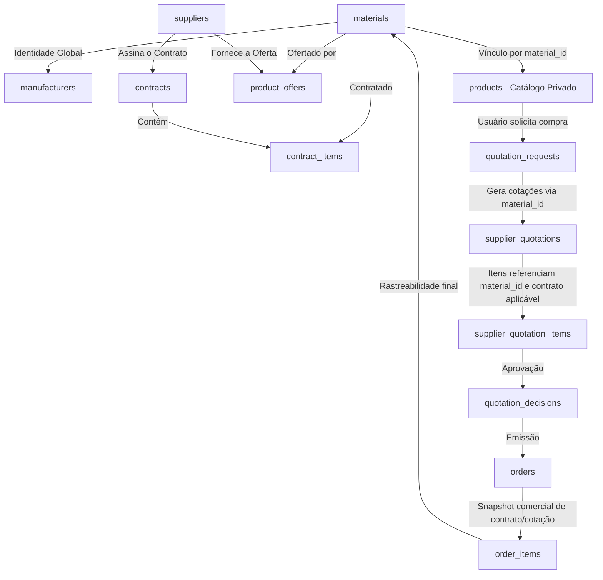

# FLUXO ARQUITETURAL: MATERIAL MASTER AO PEDIDO

## Resumo do Ciclo de Vida
1. A Organização Compradora **interna** o `materials.id` dentro do seu catálogo `products`.
2. A Organização Fornecedora expõe sua venda através de `product_offers.material_id`.
3. Ambos podem formalizar um **Contrato** cujos itens amarram `contract_items.material_id`.
4. Uma requisição entra via `quotation_requests` vinculada à Organização compradora.
5. Quando gerada a Cotação (RFQ/Quotation), o sistema avalia se há Contrato pré-existente.
6. A finalização no Pedido gera um snapshot inalterável das condições acordadas, garantindo isolamento temporal.
